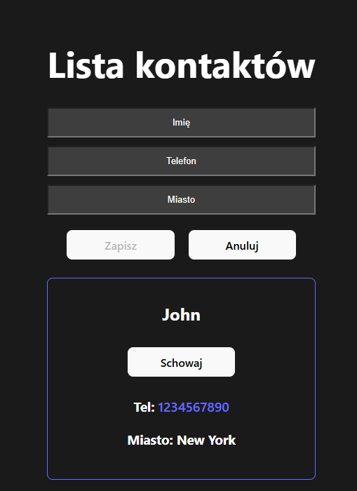
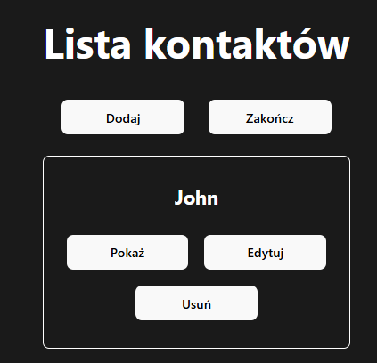

# Lista Kontaktów 📋

"Lista Kontaktów" to aplikacja napisana w React, umożliwiająca zarządzanie listą kontaktów. 
Użytkownik może dodawać, edytować oraz usuwać kontakty. Aplikacja pozwala również na wyświetlanie 
szczegółowych informacji o każdym kontakcie, w tym klikalnego numeru telefonu.

## 📋 Funkcjonalności

- 📞 Dodawanie kontaktów: Użytkownik może dodać nowe kontakty, podając imię, numer telefonu i miasto.
- ✏️ Edycja kontaktów: Możliwość edytowania istniejących kontaktów.
- ❌ Usuwanie kontaktów: Usuwanie wybranych kontaktów z listy.
- 🔍 Wyświetlanie szczegółów: Rozwijanie karty kontaktu, aby zobaczyć jego szczegóły.
- 🖤 Interaktywny interfejs: Intuicyjny interfejs użytkownika ułatwiający zarządzanie kontaktami.

## 🛠️ Technologie
- **React**  – Komponenty funkcyjne.
- **Vite** – Szybkie budowanie aplikacji.
- **Css** - Stylizacja.

## 📷 Zrzut ekranu aplikacji

### Ekran główny oraz Widok dodawania użytkownika i edytowania


### Widok edytowania


## 🚀 Jak uruchomić projekt
1. Sklonuj repozytorium:
   ```bash
   git clone https://github.com/Kroliczak212/easy-contactlist.git
